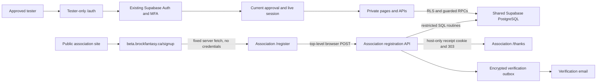

# Public Enrollment and Private Beta

Implementation date: October 9, 2026. Local implementation only. No hosted migration, deployment, DNS, Cloudflare, credential, or dashboard change is implied by this document.

## Ownership

`brock-fantasy` owns all shared Supabase migrations and application authorization. `brock-fantasy-association` owns public enrollment, consent copy, verification delivery, unsubscribe, and server-rendered confirmation pages. There is one existing hosted Supabase project, not a new registration database.

## Exact Initial Approvals

| Name              | Email                         | Existing Authority                                                 |
| ----------------- | ----------------------------- | ------------------------------------------------------------------ |
| Ty Mabee          | tymabee@proton.me             | Super administrator and approved tester; protected operator record |
| Tarik Merchant    | gt22me@brocku.ca              | Approved tester; existing regular admin role is retained           |
| Ethan_Greatorex   | ethan.greatorex1245@gmail.com | Approved tester; existing regular admin role is retained           |
| Nicholas Zadravec | ci22wd@brocku.ca              | Approved tester and explicitly requested regular administrator     |

The access migration binds matching existing Auth IDs without replacing profiles, passwords, MFA, league membership, or gameplay records. It does not insert, update or delete Ethan/Tarik's `user_roles` records. Nicholas receives an additive, audited `admin` grant only when his existing account meets the established verified-email, eligibility and verified-TOTP requirements; otherwise Ty must complete the protected admin invitation flow before rollout acceptance. He is not a protected super administrator. An approval-sensitive email change or deleted/recreated identity is denied until Ty reapproves it. Ty's operator approval cannot be revoked through ordinary tester management.

## Deployment Order and Mandatory Gates

1. Keep the current beta protected during preparation. Record the current production/branch deployment IDs and domain assignments. Obtain a protected backend backup and demonstrate restoration in disposable local Supabase. Never reset the shared hosted project.
2. Read the hosted schema, grants, exposed schemas, storage buckets, Realtime publication, Auth settings/hooks, and all four exact Auth identities. Verify Tarik/Ethan already have `admin`, and Ty retains `admin`, the protected manager record, and verified TOTP. Confirm Nicholas's verified identity, eligibility and enrolled TOTP before his additive admin grant. Stop rollout if any expected identity or prerequisite is absent; investigate or complete tester activation rather than replacing accounts. After migration, verify Nicholas has `admin` but no protected-manager grant.
3. Review both new additive migrations: `20261009161432_application_access.sql` and `20261009161434_prelaunch_registration.sql`. Application enforcement begins at database migration time. All four approval rows must bind to the expected existing IDs in the same migration. Other existing accounts remain stored but are intentionally denied. Do not apply this migration until that consequence is approved.
4. Apply migrations through the approved Supabase workflow only after backup/preflight. Do not add `beta_private`, `rpc_private`, or `registration_private` to exposed REST/GraphQL schemas. Configure Authentication > Hooks > Before User Created to use `beta_private.before_user_created`. Its only external execute grantee is `supabase_auth_admin`; the binding trigger also rejects unapproved direct creation if the hook is omitted.
5. Provision the new `prelaunch_api` login's password securely outside Git, chat, logs, and SQL-history exports. Use the Supabase Connect transaction-pooler URL with username `prelaunch_api.<project-ref>`, TLS and port 6543. Never use the application service key in the association project. Verify the login can execute enrollment routines but cannot read fantasy/Auth tables or access records. Keep `prelaunch_owner` NOLOGIN and grant it to no application role.
6. Set fantasy server Config `PUBLIC_REGISTRATION_ORIGIN=https://www.brockfantasy.ca`. Retain canonical `EXPO_PUBLIC_APP_ORIGIN=https://beta.brockfantasy.ca`, existing public Supabase config, and private `SUPABASE_SECRET_KEY`/auth throttle secret in the correct beta branch scope. They must not use an `EXPO_PUBLIC_*` prefix. Verify effective variables for the actual branch before redeploying.
7. Prepare the association deployment using its README. Keep `PRELAUNCH_INTAKE_ENABLED=false` until sender identity, privacy, consent, retention, challenge, and restricted database access are approved and tested. Public frontend changes may be deployed independently while intake is closed.
8. Deploy and test the fantasy candidate with Routing Middleware enabled before opening the public CTA/intake. Use Vercel's managed Node builder for `api/index.js`; do not pin an `@vercel/node` package as its function runtime. Check the deployed commit and build status before assuming the beta alias received `/signup`: a failed candidate leaves the previous deployment serving that hostname. Middleware covers all paths before cache, permits exact bootstrap paths and existing static legal-draft documents needed before activation, and denies alternate hosts. It does not expose the private application bundle. `/auth` is a minimal tester entry, not the exported public signup screen. Test platform rewrites, original URLs, HTML/assets and no-store headers on a protected deployment; local adapter tests alone do not prove Vercel routing.
9. Vercel dashboard: verify generated deployment URLs, branch aliases, historical deployments, preview URLs, `play.brockfantasy.ca`, share links and automation bypasses. Remove unused bypasses. Preserve only the intended reachable beta hostname. Old deployments do not acquire this middleware, so deployment protection must cover them separately. Review project-level CDN routes, which can override deployment routing.
10. Open intake only after the full anonymous/tester matrix passes. Monitor fixed-code errors, challenge failures, aggregate rate denials, outbox age and verification delivery. Do not log submitted emails, IPs, capabilities, cookies, database URLs or provider response bodies.

## Operating Tester Approvals

Ty signs in, verifies MFA, and opens `/admin/beta-testers` from Operations. Approval/revocation requires an exact email and an audit reason of at least eight characters. Existing league and admin permissions remain separate. Newly approved people use `/tester-activate` and complete the existing email verification and calendar-year eligibility requirements. Ordinary admins cannot approve testers or change Ty's protected operator access.

Approval is read on every private request; revocation is not deferred until JWT expiry. Direct Supabase REST/GraphQL reads are restricted by additive restrictive policies; exposed command wrappers and user-facing Edge Functions require application approval. Service-only workers retain their existing grants. Browser route guards are UX only.

## Enrollment and Receipt Contract

The beta signup entry fetches only the fixed association registration HTML; no beta cookie, bearer header, query destination, or provider session is forwarded. Assets, challenge and the native form action are absolute association URLs. A top-level form POST lets the association set its own host-only cookie without cross-origin AJAX/CORS or parent-domain cookies.

Form pages use `Referrer-Policy: strict-origin`, which preserves native POST Origin checks without sending URL paths/query capabilities as referrers. Do not replace it with `no-referrer` on form pages: browsers can serialize the POST Origin as null, causing a valid cross-host enrollment to be rejected. Desktop/mobile browser tests assert the exact Origin and origin-only Referer.

Successful persistence returns a 303 to `https://www.brockfantasy.ca/thanks`. The 256-bit random receipt is stored only as a SHA-256 hash and expires in 15 minutes. Cookie: `__Host-bf-signup-receipt; HttpOnly; Secure; SameSite=Lax; Path=/; Max-Age=900`, no Domain. It grants only confirmation HTML. Refresh/back/revisit is allowed within the window without extending expiry. Missing, malformed, forged, duplicate or expired cookies redirect home. Database outages return 503, not confirmation content. Never deploy a static thanks artifact or route it through the SPA fallback.

An external script revalidates browser back-forward cache restoration through a fresh server request. This is an additional history UX measure, not an authorization decision; the database receipt check remains mandatory.

Development consent is pending until explicit email confirmation. GET requests from link scanners only render the confirm/unsubscribe form; POST performs the transition. Withdrawal suppresses sending immediately; repeat enrollment cannot silently restore subscription. Verification outbox capabilities are AES-GCM encrypted and DB email tokens are hashed. The encryption key remains only in the association deployment and must be retained across rotations until pending jobs drain.

## Future Launch and Rollback

Future account activation is a separately approved release. Retain existing Auth IDs, profiles and leagues. Verify ownership before linking an enrollment; do not infer account or notification consent from development consent. Transition existing testers' public activation and `launch_state` atomically before switching phase, otherwise they correctly lose access. The current signup hook remains tester-restricted until that future onboarding release changes it deliberately.

Changing launch phase to `public` closes intake and verification confirmation; delivery rechecks phase immediately before each send. Stop/drain workers before the phase transaction to avoid an already-in-flight provider request. Maintenance closes pending/subscribed development records, purges expired receipts/tokens, removes unactivated email/name identifiers after 12 months, and purges remaining unactivated records/evidence after 24 months from the later of launch/last development send. Review these policy defaults before opening intake. No development campaign editor, public activation, or future notification system is included.

Rollback by closing enrollment and restoring a known protected deployment. Keep access policies and stored records; never drop enrollment tables or roll back to an openly reachable old beta. Cloudflare Access and DNS changes are deferred. Optional future Access is an outer boundary only and requires origin JWT validation, exact email allowlisting, direct-origin protection, and continued database authorization.

## Verification Boundary

Run `pnpm check`, `pnpm test:registration:local`, and Edge Function tests in an isolated stack. The registration rehearsal reads only platform schema definitions from the running local Docker database, creates separate disposable databases, runs all pgTAP suites, tests concurrent duplicate enrollment, and verifies an upgrade preserves all four account IDs/profiles, Ethan/Tarik/Ty's admin roles and Ty's protected manager record, while granting Nicholas regular admin only. It never migrates or resets the original database. Local middleware tests mock Vercel's `next`/`rewrite` helpers and provider replies; they prove handler decisions, not hosted CDN behavior. The association's `pnpm test:browser` covers desktop/mobile cross-host form submission using isolated test providers and receipt storage, not hosted Turnstile/PostgreSQL/email. Hosted rollout still requires real cross-domain browser navigation, cookie expiry, mail delivery, challenge replay/host checks, direct Supabase denial, all alternate URLs, and all four approved users' preserved admin/gameplay data.

Platform references: [Vercel Routing Middleware](https://vercel.com/docs/routing-middleware), [Supabase signup hook](https://supabase.com/docs/guides/auth/auth-hooks/before-user-created-hook), [custom-role database connections](https://supabase.com/docs/guides/database/connecting-to-postgres).

### Local Results: October 9, 2026

- Both repositories' `pnpm check` passed; fantasy web, Android and iOS exports completed.
- All 329 pgTAP assertions passed on fresh migrations; ten concurrent duplicate enrollments produced one registration, ten receipts/consent events and no Auth identities.
- An existing-account upgrade preserved all four Auth IDs/profiles, Ethan/Tarik/Ty's admin roles and Ty's protected manager record. Nicholas gained regular admin only. All four AAL2 sessions could use the app as admins; only Ty could manage staff/testers.
- Real local Auth signup denied unapproved email. Auth/MFA, scoring/correction, push and account-deletion smoke tests passed in a separately created Supabase stack. Revoked live JWTs were denied at REST, RPC and every user-facing Edge Function.
- Association API/PostgreSQL integration passed with the restricted login and real routines, including receipt expiry, encrypted verification jobs, confirmation, withdrawal, duplicate handling and no Auth-user creation. Challenge and email providers were test doubles.
- All six desktop/mobile Chromium, Firefox and WebKit browser flows passed, including cross-host POST Origin/referrer headers, cookie isolation, refresh/history restoration and fresh-browser/direct thanks denial. Screenshots were checked locally; actual Safari/device and hosted-provider rehearsal remains required.
- The separately created Supabase stack was stopped after testing. No hosted database, Vercel deployment, live provider, DNS or Cloudflare configuration was changed or verified by these tests.
