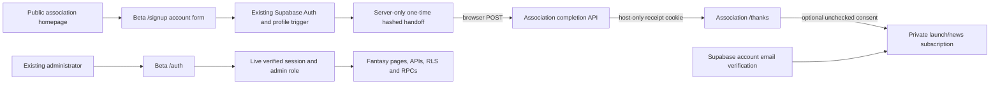

# Public Accounts and Administrator-Only Beta

Hosted rollout executed October 9, 2026, at the user's request. Public account registration is live; the fantasy application remains administrator-only. Remaining acceptance checks are listed below. [Hosted evidence](dev/docs/evidence/2026-10-09-registration-rollout.json).

## Hosted Status and Remaining Acceptance

- Applied all three pending additive migrations to the existing Supabase project `fdovowiihxowzatewxgv`. Preserved all four existing Auth IDs, the three existing admin roles and Ty's protected manager row. Current counts after the named regular-user test: five Auth users/profiles, three admins, 120 athletes and zero leagues.
- Enabled the Before User Created hook and configured Resend SMTP as `Brock Fantasy <accounts@brockfantasy.ca>`. Signup and email confirmation remain enabled with the exact beta callback allowlist. The user received and verified the real test email; hosted Auth readback and a password session confirmed verification.
- Provisioned the association's restricted transaction-pooler login, verified TLS with the Supabase CA, and proved that direct reads of Auth/fantasy/consent tables are denied. Credentials remain private server Secrets; the association has no Auth/service key.
- Deployed the association before the fantasy beta. Public `/register` redirects to beta `/signup`; receipt-protected `/thanks`, refresh, one-use handoff replay rejection, wrong-origin rejection and fresh-session denial passed over hosted HTTP. Optional consent progressed through pending, confirmed and withdrawn; the test account finishes unsubscribed.
- A verified regular Auth session returns `can_use_app=false`, reads no athlete/profile/role rows, and receives 403 from private beta pages/APIs. Public forms contain no Expo application bundle. Private schemas return `PGRST106` when explicitly selected through authenticated REST. Anonymous ingestion is denied.
- Generated current/historical fantasy URLs require Vercel authentication. `play.brockfantasy.ca` now redirects to beta, closing the previous custom-domain application route. Owner-controlled automation bypasses remain privileged credentials; access with such a credential is not anonymous access.
- Encrypted backups were copied to Google Drive. Actual offsite database restoration succeeded in a disposable container before migrations and again with the new schemas/migrations and test account. This proves database integrity and role-manager restoration, not website/Auth API journeys, Storage objects, external configuration or independently retrieved password-manager recovery.

Acceptance still requires the following personal and browser checks:

1. Nicholas must complete his existing pending invitation with his own authenticator. His email and eligibility are verified, but he has no verified TOTP factor or admin role. The conditional migration correctly left his role unchanged. Ty can inspect the invitation in [Staff accounts](https://beta.brockfantasy.ca/admin/accounts); use the existing invitation or resend there if it expires. Retain the acceptance audit reference.
2. Ty, Tarik, Ethan and Nicholas must sign in on the new deployment and verify MFA-protected administration. Ty's existing eligibility attestation is absent and was not supplied on his behalf. The current rollout did not have an interactive browser or their passwords/authenticators, so database role/factor readback is not their sign-in acceptance.
3. Rehearse actual browser signup and same-browser PKCE return, receipt isolation/back/refresh, and desktop/mobile behavior. The real email was verified by the user outside the automated cookie context; the hosted PKCE callback itself was not exercised with that context. Existing local browser/adapter coverage does not replace this hosted check.
4. Complete the existing hosted league/draft/scoring rehearsal against approved data. There are currently no hosted leagues, and this rollout did not fabricate a league, game or score. The broader policy/public-launch gates remain in `dev/TODO.md`.
5. In the association project's Vercel Settings > Cron Jobs, run `/api/internal/prelaunch-maintenance` and retain its 200 log. The enabled daily definition points to the final deployment; canonical/generated requests without the secret return 404, and production-host authorization passes regression tests. The hosted secret-authenticated invocation remains unverified: automatic approval review rejected the command that decrypted the local DPAPI cron secret, with only "blocked by policy" as its reason. No secret-authenticated request ran.

The working-tree deployment includes runtime packaging, strict pooler CA trust, original-URL auth adapter and backup-schema fixes. These changes and this evidence are uncommitted; no commit or push was performed. Record a source revision before the next release so future Git deployments include these fixes.

## Ownership

- `brock-fantasy` owns Supabase Auth, account/profile creation, all shared migrations and fantasy authorization.
- `brock-fantasy-association` owns the public homepage and receipt-protected thanks page with optional launch/news consent.
- Both independently deployed Vercel projects use the existing Supabase database. The association never receives the Auth/service key.

## Current Authority

| Person            | Email                         | Authority To Preserve                            |
| ----------------- | ----------------------------- | ------------------------------------------------ |
| Ty Mabee          | tymabee@proton.me             | Admin and sole protected super administrator     |
| Tarik Merchant    | gt22me@brocku.ca              | Regular administrator                            |
| Ethan_Greatorex   | ethan.greatorex1245@gmail.com | Regular administrator                            |
| Nicholas Zadravec | ci22wd@brocku.ca              | Requested regular admin; pending TOTP acceptance |

The new migration does not insert, update or delete existing admin roles, profiles, MFA factors, passwords or league data. The earlier additive migration grants Nicholas admin only when his existing verified account meets eligibility and verified-TOTP requirements. If that prior grant was not completed, Ty must finish the invitation workflow before rollout acceptance. Do not invent an identity or replace an existing account.

There is no beta-tester role or management UI. Historical `beta_private.application_access` rows remain archival; they grant no access. Retired approval RPCs have no application-role execution grants. Current `public.can_use_app()` checks a verified Auth user, live session, non-deleted profile and server-owned `user_roles.role='admin'`. Privileged administration still requires AAL2/TOTP; only Ty's protected manager can manage staff.

## Account Signup

`/signup` is rewritten to the minimal server-rendered account form. It uses the existing `/api/auth/sign-up`, calendar-year eligibility requirement, PKCE, Supabase email verification and profile trigger. The old mailing-list intake/privacy/Turnstile/Resend switches no longer control account signup. No new authentication provider is introduced.

Signup forwards only validated email, display name, password and eligibility metadata. Client role/admin flags are ignored. Signup never returns application tokens or sets application access/refresh cookies, even if Supabase email confirmation is disabled. Enable confirmation in hosted Auth settings before rollout. Regular Auth JWTs still cannot access fantasy data directly.

`beta_private.before_user_created` now allows public account creation. Its Auth-only execution grants remain. The old binding trigger is dropped, not replaced with a self-editable authorization field.

Duplicate signup follows Supabase's privacy behavior. An obfuscated user ID receives a generic receipt, which cannot read or change an existing account's consent. Password/provider errors remain generic. Existing accounts are not overwritten or deleted.

## Secure Thanks Handoff

1. The fantasy server creates a random 256-bit ticket and persists its SHA-256 hash using the service-only `issue_account_signup_handoff` RPC.
2. After accepted signup it returns a small HTML form that automatically POSTs the ticket to the association `/api/prelaunch/complete-signup`. A manual Continue button works without JavaScript.
3. The association validates the exact canonical Origin, consumes the ticket atomically and rotates it to a different random receipt.
4. A host-only `__Host-bf-signup-receipt` cookie is HttpOnly, Secure, SameSite=Lax, Path=/, Max-Age=900, without Domain.
5. The association 303-redirects to `/thanks`, where PostgreSQL validates the receipt before any confirmation HTML is returned.

Tickets/receipts are never query parameters or localStorage flags. No beta/application cookie is forwarded. Tickets are one-use; receipts permit refresh/back/revisit only within the original 15-minute database window, without extension. Cookies may outlive that original window but cannot bypass the database expiry. Responses are private/no-store, and BFCache restoration revalidates. Direct `/thanks` without a receipt redirects home. Database failure returns 503, not false success.

Account creation commits before the handoff. A subsequent handoff/outage cannot roll it back; do not delete the account as compensation. Show a generic error, retain the account and its verification email, and investigate the fixed provider/database failure. The activation callback can issue a fresh receipt after verified ownership. Invalid/expired PKCE links retain the existing safe failure path.

## Optional Launch and News Emails

The thank-you page offers an unchecked, explicit consent checkbox and Return to Landing Page button. Creating an account alone inserts no subscription. The newsletter API accepts no user-selected email, user ID or permission field; identity is derived from the valid receipt.

New consent is stored separately from the historical development-only registrations. Pending consent becomes subscribed only after the same Auth email is verified. Email changes suppress old-address subscriptions, rather than moving consent to a new address. Withdrawal is immediate, account-free through a hashed unsubscribe capability, and cannot be silently reversed by duplicate signup. GET only displays withdrawal confirmation; POST changes state.

This release collects preferences; it does not implement a launch/news campaign sender or send campaign messages. Before a sender is added, review sender identity, contact/postal information, privacy, retention and consent copy; mint fresh unsubscribe capabilities at send time and preserve them for the required validity period. Every delivery must recheck subscribed state and current matching verified Auth email. Do not repurpose old development-only consent or infer account-notification preferences.

## Staff Invitations

Normal `/auth` sign-in and recovery are administrator-only. Ty can invite a verified registered account through existing staff management.

An invitation uses a separate `/staff-activate?invitation=<id>` page. Old emailed `/mfa?invitation=<id>` URLs are rewritten there. Only the live, verified, identity-bound pending invitation can establish an isolated 15-minute HttpOnly staff cookie. That cookie cannot authorize the private application or its APIs/assets. Staff enrollment supports explicit setup/restart of incomplete TOTP factors; verified factors are never deleted. Verification upgrades only the staff cookie. The existing database acceptance RPC rechecks invitation expiry, identity, Ty's authority, eligibility, verified TOTP and AAL2 before granting regular admin. Acceptance clears the staff cookie and sends the new admin to normal sign-in.

## Approved Hosted Rollout

1. Record both projects' deployed commits/domains and current database counts. Obtain a protected backup and prove restoration. Never reset hosted or ordinary development Supabase.
2. Verify all four exact Auth IDs, current `admin` roles, eligibility/MFA, and Ty's protected manager row. Resolve missing Nicholas prerequisites through the existing staff workflow, not by replacing accounts.
3. Apply additive migrations in timestamp order through the approved Supabase workflow. Include `20261009232603_public_accounts_admin_access.sql` after the prior access/registration migrations. No historical migration was rewritten.
4. Verify Authentication > Hooks > Before User Created points to the updated `beta_private.before_user_created`; verify signup enabled, email confirmations enabled, real SMTP/rate limits, and exact `https://beta.brockfantasy.ca/api/auth/callback` redirect allowlisting.
5. Do not expose private schemas through REST/GraphQL. Verify storage policies, views, Realtime publications and user-facing Edge Function checks.
6. Provision the existing restricted `prelaunch_api` login securely outside source/chat/SQL history. Set association `PRELAUNCH_DATABASE_URL` to the Supabase TLS transaction pooler, username `prelaunch_api.<project-ref>`. Prove it can execute completion/consent routines but cannot read Auth/fantasy tables.
7. Fantasy branch runtime needs existing public Supabase configuration, `EXPO_PUBLIC_APP_ORIGIN=https://beta.brockfantasy.ca`, private `SUPABASE_SECRET_KEY`, `AUTH_RATE_LIMIT_HMAC_SECRET`, and server `PUBLIC_REGISTRATION_ORIGIN=https://www.brockfantasy.ca`. Never put private keys under a public prefix.
8. Association needs canonical origins, restricted database URL, `PRELAUNCH_DATABASE_CA_CERT` and protected maintenance `CRON_SECRET`. Legacy development-email variables can stay disabled; they do not block account signup. Do not enable old intake to fix the new flow. The maintenance handler also accepts the exact runtime-provided Vercel production hostnames, exclusively with its valid secret; public handlers retain canonical-origin checks. The configured daily schedule is `0 8 * * *` UTC.
9. Deploy association completion/thanks handlers before the fantasy signup candidate, under protection. Verify original URLs, API route precedence, native Node imports, middleware before cache and managed Vercel Node runtime. A failed build leaves the old deployment live.
10. Verify deployment protection covers generated URLs, branch aliases, historical deployments, preview URLs, `play.brockfantasy.ca`, share links and automation bypasses. Middleware protects only deployments containing it. Keep Vercel DNS; Cloudflare Access remains deferred.
11. Test a named new regular account, real verification delivery, optional consent and anonymous denial; then test all four admins, MFA, scoring/league workflows and staff onboarding. Confirm no regular signup grants app access. Monitor fixed-code failures without logging emails, passwords, tokens or secrets.

Rollback should keep protected deployments and authorization in place. Disable the public signup entry if needed, retain additive data/schema and account identities, and do not return to an openly accessible beta.

## Local Verification

- `pnpm check`: formatting, lint, SQL parsing, types, domain/import tests, middleware tests, web/server export, secret-boundary scanning, real Expo-adapter auth/admin fixtures and Android/iOS exports.
- `pnpm test:registration:local`: creates disposable PostgreSQL databases, reads only local platform schemas, applies all migrations, runs pgTAP and rehearses upgrade preservation. It does not reset the ordinary development database.
- Association `pnpm check`: server/frontend types, build, behavioral tests, plain compiled Node runtime imports and browser secret scan.
- Association `pnpm test:browser`: actual A account handlers and B confirmation handlers on different local hostnames; only provider/database I/O is mocked. Chrome/Firefox/WebKit desktop/mobile coverage includes unchecked consent, receipt isolation, refresh, back and fresh-browser denial.
- Association `pnpm test:accounts:local`: actual Supabase Auth and restricted PostgreSQL integration against the explicitly named local QA stack, using the real Expo adapter and association handlers. Verifies account/profile persistence, no admin role or automatic subscription, handoff, thanks, pending/confirmed/withdrawn consent, and direct REST/RPC/admin-sign-in denial. The test confirms email through the local administrative API; it does not prove SMTP delivery.
- Real Edge/Auth integration must use an isolated QA stack with all current migrations, never destructive fixtures against the shared hosted backend.

Local validation is not hosted readiness, SMTP delivery, device certification or launch approval. Public launch remains a separate release: enable verified regular-user application access deliberately while retaining Auth IDs/profiles and existing subscriptions.
